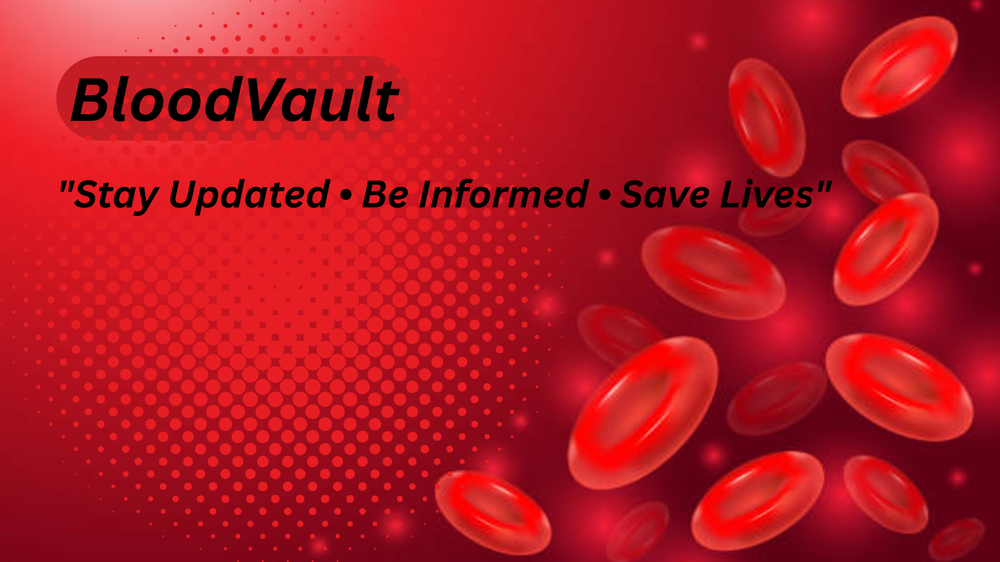

<h1>🩸 BloodVault – Blood Bank Management System</h1>

  
  
  

<blockquote>
  An intelligent, immersive and full-featured web platform for managing blood donations, inventory, hospitals, and AI-driven emergency predictions.
</blockquote>

<h2>📸 Project Banner</h2>

<h2>🧠 Description</h2>

  <strong>BloodVault</strong> is a comprehensive Blood Bank Management System crafted with love (and PHP). Designed to manage <strong>donors</strong>, <strong>hospitals</strong>, and <strong>blood centers</strong>, it also features an AI-powered chatbot that answers medical and system-related queries in real-time. The platform offers dashboards, donation tracking, emergency request handling, accident reporting, and interactive maps.

This is Phase 1 of development, but it already packs some serious life-saving potential.

<h2>🛠️ Built With</h2>
<ul>
  <li>💻 <strong>Frontend</strong>: HTML5, CSS3, JavaScript</li>
  <li>🐘 <strong>Backend</strong>: PHP</li>
  <li>🐬 <strong>Database</strong>: MySQL</li>
  <li>🗺️ <strong>Maps</strong>: Leaflet.js (for Blood Center Maps)</li>
  <li>🤖 <strong>AI Bot</strong>: JavaScript-based chatbot with 100+ built-in FAQs</li>
  <li>📱 <strong>UX</strong>: Fully responsive and mobile-friendly</li>
</ul>

<h2>✨ Key Features</h2>
<ul>
  <li>✅ Donor, Hospital & Blood Bank role-based dashboards</li>
  <li>✅ Smart login with role access control</li>
  <li>✅ Blood request and emergency request handling</li>
  <li>✅ Blood inventory and transaction management</li>
  <li>✅ AI-powered FAQ bot with typing animation and 100+ queries</li>
  <li>✅ Accident reporting system with severity tracking</li>
  <li>✅ Awareness campaign creation & listing</li>
  <li>✅ Dark mode & interactive themes (planned)</li>
  <li>✅ Map integration for blood bank locations</li>
</ul>

<h2>🚀 Getting Started</h2>

<h3>🧬 Prerequisites</h3>
<ul>
  <li>PHP (v7+ or v8)</li>
  <li>MySQL / MariaDB</li>
  <li>XAMPP / WAMP / LAMP for local setup</li>
</ul>

<h3>🛠️ Setup Instructions</h3>
<ol>
  <li>Clone this repo:
    <pre><code>git clone https://github.com/Siddu-03/BloodBank.git</code></pre>
  </li>
  <li>Import the database via phpMyAdmin:
    <ul>
      <li>Create a database named <code>dbbb</code></li>
      <li>Import the <code>dbbb.sql</code> file from the <code>/sql</code> folder</li>
    </ul>
  </li>
  <li>Run Apache and MySQL</li>
  <li>Open your browser at <code>http://localhost/bloodvault/</code></li>
</ol>

<h2>🧠 AI Chatbot Capabilities</h2>
<ul>
  <li>100+ built-in Q&As</li>
  <li>Covers accident predictions, blood types, emergencies, donation rules, system usage</li>
  <li>Live typing animation with 3-dot loading</li>
  <li>Works via "Send" button or Enter key</li>
  <li>Fun & informative 💬</li>
</ul>

<h2>📢 Campaigns & Announcements</h2>

Admins can:

<ul>
  <li>Create awareness campaigns</li>
  <li>Schedule events</li>
  <li>View upcoming drives (auto-hides past events)</li>
</ul>

<h2>🎓 Educational Angle</h2>

This project is ideal for:

<ul>
  <li>Academic submission</li>
  <li>DBMS + Web dev integration</li>
  <li>Learning role-based access systems</li>
  <li>Exploring emergency medical workflows with AI help</li>
</ul>

<h2>🙌 Credits</h2>

  This system was built as part of a college-level database project, with a goal to modernize how blood donation and hospital coordination work.

<blockquote>
  <strong>Special thanks to ChatGPT</strong> for assisting in every line of PHP and debugging like a real teammate 👨‍💻
</blockquote>

<h2>❤️ Want to Contribute?</h2>

Pull requests are welcome! We’d love your help expanding:

<ul>
  <li>Campaign modules</li>
  <li>Inventory visualization</li>
  <li>Real-time notifications</li>
  <li>Admin analytics panel</li>
</ul>

<h2>🚧 Phase 2 Coming Soon</h2>
<ul>
  <li>📊 AI Dashboard Analytics</li>
  <li>🔄 Auto Blood Stock Reallocation</li>
  <li>🌍 Real-time GPS Integration</li>
  <li>💬 ChatGPT API Integration</li>
  <li>🌓 Dark Mode & PWA Support</li>
</ul>

<h2>😄 Fun Fact</h2>
<blockquote>
  We built something that might actually save lives. If that’s not cool, what is?
</blockquote>

<strong>→ Ready to donate digitally? Let’s go!</strong>

